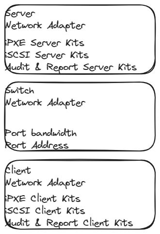
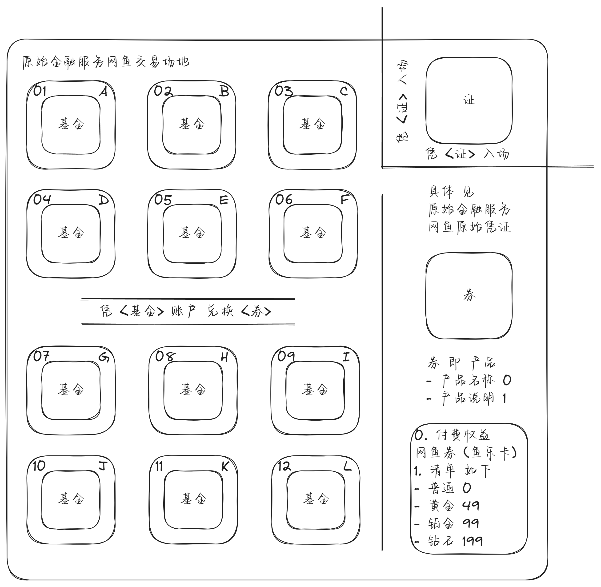

# own-pypxeserver

## Dot

0. ^ "Combined standard DHCP and redirection services. The DHCP servers that are supplying IP addresses to clients are modified to become, or are replaced by servers that serve up IP addresses for all clients and redirect PXE-enabled clients to Boot Servers as requested."
1. ^ "Separate standard DHCP and redirection services. PXE redirection servers (Proxy DHCP servers) are added to the existing network environment. They respond only to PXE-enabled clients, and provide only redirection to Boot Servers."

```plain
PS C:\Users\ecs-user\Downloads\own-pypxeserver> # Install [2017.09 python-3.7.0-amd64.exe | Huaweicloud](https://mirrors.huaweicloud.com/python/3.7.0/python-3.7.0-amd64.exe)
PS C:\Users\ecs-user\Downloads\own-pypxeserver>
PS C:\Users\ecs-user\Downloads\own-pypxeserver> # Install [2023.03 pywin32-306.win-amd64-py3.7.exe | Github](https://github.com/mhammond/pywin32/releases/download/b306/pywin32-306.win-amd64-py3.7.exe)
PS C:\Users\ecs-user\Downloads\own-pypxeserver>
PS C:\Users\ecs-user\Downloads\own-pypxeserver> # Start server.py
PS C:\Users\ecs-user\Downloads\own-pypxeserver> Remove-Item -ErrorAction Ignore -Recurse -Path '.\*.log', '__pycache__' ; python .\server.py
```

## Infrastructure




## Dot

server.py

```plain
self.separate = 1
self.path = r'C:\Users\ecs-user\Downloads\own-pypxeserver\files'
self.siaddr = '192.168.0.7'
```

server.log

```plain
2024-05-08 17:48:59.493 udp_server PATH C:\Users\ecs-user\Downloads\own-pypxeserver\files
2024-05-08 17:48:59.493 DHCPc (68) 0.0.0.0 started...
2024-05-08 17:48:59.493 DHCPd (67) 0.0.0.0 started...
2024-05-08 17:48:59.493 PorxyDHCPd (4011) 192.168.0.7 started...
2024-05-08 17:48:59.493 TFTPd (69) 0.0.0.0 started...
2024-05-08 17:48:59.493 HTTPd (80) 0.0.0.0 started...
2024-05-08 17:49:18.563 DHCPd (67) DHCPDISCOVER received, MAC 08:00:27:D8:7A:FA, XID 1545842972
2024-05-08 17:49:18.563 DHCPd (67) msg is b"\x01\x01\x06\x00\\#\xb1\x1c\x00\x04\x00\x00\x00\x00\x00\x00\x00\x00\x00\x00\x00\x00\x00\x00\x00\x00\x00\x00\x08\x00'\xd8z\xfa\x00\x00\x00\x00\x00\x00\x00\x00\x00\x00\x00\x00\x00\x00\x00\x00\x00\x00\x00\x00\x00\x00\x00\x00\x00\x00\x00\x00\x00\x00\x00\x00\x00\x00\x00\x00\x00\x00\x00\x00\x00\x00\x00\x00\x00\x00\x00\x00\x00\x00\x00\x00\x00\x00\x00\x00\x00\x00\x00\x00\x00\x00\x00\x00\x00\x00\x00\x00\x00\x00\x00\x00\x00\x00\x00\x00\x00\x00\x00\x00\x00\x00\x00\x00\x00\x00\x00\x00\x00\x00\x00\x00\x00\x00\x00\x00\x00\x00\x00\x00\x00\x00\x00\x00\x00\x00\x00\x00\x00\x00\x00\x00\x00\x00\x00\x00\x00\x00\x00\x00\x00\x00\x00\x00\x00\x00\x00\x00\x00\x00\x00\x00\x00\x00\x00\x00\x00\x00\x00\x00\x00\x00\x00\x00\x00\x00\x00\x00\x00\x00\x00\x00\x00\x00\x00\x00\x00\x00\x00\x00\x00\x00\x00\x00\x00\x00\x00\x00\x00\x00\x00\x00\x00\x00\x00\x00\x00\x00\x00\x00\x00\x00\x00\x00\x00\x00\x00\x00\x00\x00\x00\x00\x00\x00\x00\x00\x00\x00\x00\x00\x00\x00c\x82Sc5\x01\x019\x02\x05\xc0]\x02\x00\x00^\x03\x01\x02\x01< PXEClient:Arch:00000:UNDI:002001M\x04iPXE7\x17\x01\x03\x06\x07\x0c\x0f\x11\x1a+<BCw\x80\x81\x82\x83\x84\x85\x86\x87\xaf\xcb\xaf\x18\xb1\x05\x01\x80\x86\x10\x0e!\x01\x01\x10\x01\x02\xeb\x03\x01\x00\x00\x17\x01\x01\x15\x01\x01=\x07\x01\x08\x00'\xd8z\xfaa\x11\x00+\x83\xd4~{(Fa\x8f\rG\xc2\xab{\x1a\xae\xff"
2024-05-08 17:49:18.577 DHCPd (67) iPXE user-class detected
2024-05-08 17:49:18.579 DHCPd (67) DHCPOFFER sent, 255.255.255.255:68, XID 1545842972
2024-05-08 17:49:18.579 DHCPd (67) offer_packet is b"\x02\x01\x06\x00\\#\xb1\x1c\x00\x00\x80\x00\x00\x00\x00\x00\x00\x00\x00\x00\xc0\xa8\x00\x07\x00\x00\x00\x00\x08\x00'\xd8z\xfa\x00\x00\x00\x00\x00\x00\x00\x00\x00\x00y007\x00\x00\x00\x00\x00\x00\x00\x00\x00\x00\x00\x00\x00\x00\x00\x00\x00\x00\x00\x00\x00\x00\x00\x00\x00\x00\x00\x00\x00\x00\x00\x00\x00\x00\x00\x00\x00\x00\x00\x00\x00\x00\x00\x00\x00\x00\x00\x00\x00\x00\x00\x00\x00\x00\x00\x00\x00\x00\x00\x00pxelinux.0\x00\x00\x00\x00\x00\x00\x00\x00\x00\x00\x00\x00\x00\x00\x00\x00\x00\x00\x00\x00\x00\x00\x00\x00\x00\x00\x00\x00\x00\x00\x00\x00\x00\x00\x00\x00\x00\x00\x00\x00\x00\x00\x00\x00\x00\x00\x00\x00\x00\x00\x00\x00\x00\x00\x00\x00\x00\x00\x00\x00\x00\x00\x00\x00\x00\x00\x00\x00\x00\x00\x00\x00\x00\x00\x00\x00\x00\x00\x00\x00\x00\x00\x00\x00\x00\x00\x00\x00\x00\x00\x00\x00\x00\x00\x00\x00\x00\x00\x00\x00\x00\x00\x00\x00\x00\x00\x00\x00\x00\x00\x00\x00\x00\x00\x00\x00\x00\x00c\x82Sc5\x01\x02\r\x02\x0046\x04\xc0\xa8\x00\x07<\tPXEClientB\x0b192.168.0.7\xff"
2024-05-08 17:49:19.587 DHCPd (67) DHCPREQUEST discarded, MAC 08:00:27:D8:7A:FA, XID 1545842972
2024-05-08 17:49:19.587 DHCPc (68) discovering for another DHCPd on LAN
2024-05-08 17:49:19.587 DHCPc (68) another DHCPd detected on your LAN @ 192.168.0.7
2024-05-08 17:49:19.587 DHCPc (68) BOOTREPLY received, MAC 08:00:27:D8:7A:FA, XID 1545842972
2024-05-08 17:49:19.587 DHCPc (68) msg is b"\x02\x01\x06\x00\\#\xb1\x1c\x00\x00\x80\x00\x00\x00\x00\x00\x00\x00\x00\x00\xc0\xa8\x00\x07\x00\x00\x00\x00\x08\x00'\xd8z\xfa\x00\x00\x00\x00\x00\x00\x00\x00\x00\x00y007\x00\x00\x00\x00\x00\x00\x00\x00\x00\x00\x00\x00\x00\x00\x00\x00\x00\x00\x00\x00\x00\x00\x00\x00\x00\x00\x00\x00\x00\x00\x00\x00\x00\x00\x00\x00\x00\x00\x00\x00\x00\x00\x00\x00\x00\x00\x00\x00\x00\x00\x00\x00\x00\x00\x00\x00\x00\x00\x00\x00pxelinux.0\x00\x00\x00\x00\x00\x00\x00\x00\x00\x00\x00\x00\x00\x00\x00\x00\x00\x00\x00\x00\x00\x00\x00\x00\x00\x00\x00\x00\x00\x00\x00\x00\x00\x00\x00\x00\x00\x00\x00\x00\x00\x00\x00\x00\x00\x00\x00\x00\x00\x00\x00\x00\x00\x00\x00\x00\x00\x00\x00\x00\x00\x00\x00\x00\x00\x00\x00\x00\x00\x00\x00\x00\x00\x00\x00\x00\x00\x00\x00\x00\x00\x00\x00\x00\x00\x00\x00\x00\x00\x00\x00\x00\x00\x00\x00\x00\x00\x00\x00\x00\x00\x00\x00\x00\x00\x00\x00\x00\x00\x00\x00\x00\x00\x00\x00\x00\x00\x00c\x82Sc5\x01\x02\r\x02\x0046\x04\xc0\xa8\x00\x07<\tPXEClientB\x0b192.168.0.7\xff"
2024-05-08 17:49:19.607 TFTPd (69) DoReadFile pxelinux.0 B 26579 T 0
2024-05-08 17:49:19.696 TFTPd (69) DoReadFile default B 1948 T 0
2024-05-08 17:49:19.711 TFTPd (69) DoReadFile menu.c32 B 56292 T 0
2024-05-08 17:49:19.796 TFTPd (69) DoReadFile default B 1948 T 0
2024-05-08 17:49:25.843 HTTPd (80) DoGetFile wimboot B 59296 T 0
2024-05-08 17:49:28.544 DHCPc (68) stopped...
2024-05-08 17:49:28.544 DHCPd (67) stopped...
2024-05-08 17:49:28.544 PorxyDHCPd (4011) stopped...
2024-05-08 17:49:28.544 TFTPd (69) stopped...
2024-05-08 17:49:28.544 HTTPd (80) stopped...
```

## Dot

server.py

```plain
self.separate = 0
self.path = r'C:\Users\ecs-user\Downloads\own-pypxeserver\files'
self.siaddr = '192.168.56.7'
self.router = '192.168.56.1'
self.begin = '192.168.56.100'
self.end = '192.168.56.110'
```

server.log

```plain
2024-05-08 18:00:22.012 udp_server PATH C:\Users\ecs-user\Downloads\own-pypxeserver\files
2024-05-08 18:00:22.012 DHCPc (68) 0.0.0.0 started...
2024-05-08 18:00:22.027 DHCPd (67) 0.0.0.0 started...
2024-05-08 18:00:22.027 TFTPd (69) 0.0.0.0 started...
2024-05-08 18:00:22.027 HTTPd (80) 0.0.0.0 started...
2024-05-08 18:00:45.562 DHCPd (67) DHCPDISCOVER received, MAC 08:00:27:D8:7A:FA, XID 4081369149
2024-05-08 18:00:45.562 DHCPc (68) discovering for another DHCPd on LAN
2024-05-08 18:00:45.562 DHCPd (67) msg is b"\x01\x01\x06\x00\xf3D\xc0=\x00\x04\x00\x00\x00\x00\x00\x00\x00\x00\x00\x00\x00\x00\x00\x00\x00\x00\x00\x00\x08\x00'\xd8z\xfa\x00\x00\x00\x00\x00\x00\x00\x00\x00\x00\x00\x00\x00\x00\x00\x00\x00\x00\x00\x00\x00\x00\x00\x00\x00\x00\x00\x00\x00\x00\x00\x00\x00\x00\x00\x00\x00\x00\x00\x00\x00\x00\x00\x00\x00\x00\x00\x00\x00\x00\x00\x00\x00\x00\x00\x00\x00\x00\x00\x00\x00\x00\x00\x00\x00\x00\x00\x00\x00\x00\x00\x00\x00\x00\x00\x00\x00\x00\x00\x00\x00\x00\x00\x00\x00\x00\x00\x00\x00\x00\x00\x00\x00\x00\x00\x00\x00\x00\x00\x00\x00\x00\x00\x00\x00\x00\x00\x00\x00\x00\x00\x00\x00\x00\x00\x00\x00\x00\x00\x00\x00\x00\x00\x00\x00\x00\x00\x00\x00\x00\x00\x00\x00\x00\x00\x00\x00\x00\x00\x00\x00\x00\x00\x00\x00\x00\x00\x00\x00\x00\x00\x00\x00\x00\x00\x00\x00\x00\x00\x00\x00\x00\x00\x00\x00\x00\x00\x00\x00\x00\x00\x00\x00\x00\x00\x00\x00\x00\x00\x00\x00\x00\x00\x00\x00\x00\x00\x00\x00\x00\x00\x00\x00\x00\x00\x00\x00\x00\x00\x00\x00\x00c\x82Sc5\x01\x019\x02\x05\xc0]\x02\x00\x00^\x03\x01\x02\x01< PXEClient:Arch:00000:UNDI:002001M\x04iPXE7\x17\x01\x03\x06\x07\x0c\x0f\x11\x1a+<BCw\x80\x81\x82\x83\x84\x85\x86\x87\xaf\xcb\xaf\x18\xb1\x05\x01\x80\x86\x10\x0f!\x01\x01\x10\x01\x02\xeb\x03\x01\x00\x00\x17\x01\x01\x15\x01\x01=\x07\x01\x08\x00'\xd8z\xfaa\x11\x00+\x83\xd4~{(Fa\x8f\rG\xc2\xab{\x1a\xae\xff"
2024-05-08 18:00:45.562 DHCPc (68) another DHCPd detected on your LAN @ 192.168.56.100
2024-05-08 18:00:45.562 DHCPd (67) iPXE user-class detected
2024-05-08 18:00:45.575 DHCPc (68) BOOTREPLY received, MAC 08:00:27:D8:7A:FA, XID 4081369149
2024-05-08 18:00:45.578 DHCPc (68) msg is b"\x02\x01\x06\x00\xf3D\xc0=\x00\x00\x00\x00\x00\x00\x00\x00\xc0\xa88f\x00\x00\x00\x00\x00\x00\x00\x00\x08\x00'\xd8z\xfa\x00\x00\x00\x00\x00\x00\x00\x00\x00\x00\x00\x00\x00\x00\x00\x00\x00\x00\x00\x00\x00\x00\x00\x00\x00\x00\x00\x00\x00\x00\x00\x00\x00\x00\x00\x00\x00\x00\x00\x00\x00\x00\x00\x00\x00\x00\x00\x00\x00\x00\x00\x00\x00\x00\x00\x00\x00\x00\x00\x00\x00\x00\x00\x00\x00\x00\x00\x00\x00\x00\x00\x00\x00\x00\x00\x00\x00\x00\x00\x00\x00\x00\x00\x00\x00\x00\x00\x00\x00\x00\x00\x00\x00\x00\x00\x00\x00\x00\x00\x00\x00\x00\x00\x00\x00\x00\x00\x00\x00\x00\x00\x00\x00\x00\x00\x00\x00\x00\x00\x00\x00\x00\x00\x00\x00\x00\x00\x00\x00\x00\x00\x00\x00\x00\x00\x00\x00\x00\x00\x00\x00\x00\x00\x00\x00\x00\x00\x00\x00\x00\x00\x00\x00\x00\x00\x00\x00\x00\x00\x00\x00\x00\x00\x00\x00\x00\x00\x00\x00\x00\x00\x00\x00\x00\x00\x00\x00\x00\x00\x00\x00\x00\x00\x00\x00\x00\x00\x00\x00\x00\x00\x00\x00\x00\x00\x00\x00\x00\x00\x00\x00\x00c\x82Sc6\x04\xc0\xa88d5\x01\x02\x01\x04\xff\xff\xff\x003\x04\x00\x00\x02X\xff\x00\x00\x00\x00\x00\x00\x00\x00\x00\x00\x00\x00\x00\x00\x00\x00\x00\x00\x00\x00\x00\x00\x00\x00\x00\x00\x00\x00\x00\x00\x00\x00\x00\x00\x00\x00\x00\x00\x00\x00\x00\x00\x00\x00\x00\x00\x00\x00\x00\x00\x00\x00\x00\x00\x00\x00\x00\x00\x00\x00\x00\x00\x00\x00\x00\x00\x00\x00\x00\x00\x00\x00\x00\x00\x00\x00\x00\x00\x00\x00\x00\x00\x00\x00\x00\x00\x00\x00\x00\x00\x00\x00\x00\x00\x00\x00\x00\x00\x00\x00\x00\x00\x00\x00\x00\x00\x00\x00\x00\x00\x00\x00\x00\x00\x00\x00\x00\x00\x00\x00\x00\x00\x00\x00\x00\x00\x00\x00\x00\x00\x00\x00\x00\x00\x00\x00\x00\x00\x00\x00\x00\x00\x00\x00\x00\x00\x00\x00\x00\x00\x00\x00\x00\x00\x00\x00\x00\x00\x00\x00\x00\x00\x00\x00\x00\x00\x00\x00\x00\x00\x00\x00\x00\x00\x00\x00\x00\x00\x00\x00\x00\x00\x00\x00\x00\x00\x00\x00\x00\x00\x00\x00\x00\x00\x00\x00\x00\x00\x00\x00\x00\x00\x00\x00\x00\x00\x00\x00\x00\x00\x00\x00\x00\x00\x00\x00\x00\x00\x00\x00\x00\x00\x00\x00\x00\x00\x00\x00\x00\x00\x00\x00\x00\x00\x00\x00\x00\x00\x00\x00\x00\x00\x00\x00\x00\x00\x00\x00\x00\x00\x00\x00\x00\x00\x00\x00\x00\x00\x00\x00\x00\x00\x00\x00\x00\x00\x00\x00\x00\x00\x00\x00\x00\x00\x00\x00\x00\x00\x00\x00\x00\x00\x00\x00\x00\x00"
2024-05-08 18:00:45.578 DHCPd (67) DHCPOFFER sent, 255.255.255.255:68, XID 4081369149
2024-05-08 18:00:45.578 DHCPd (67) offer_packet is b"\x02\x01\x06\x00\xf3D\xc0=\x00\x00\x80\x00\x00\x00\x00\x00\xc0\xa88d\xc0\xa88\x07\x00\x00\x00\x00\x08\x00'\xd8z\xfa\x00\x00\x00\x00\x00\x00\x00\x00\x00\x00y007\x00\x00\x00\x00\x00\x00\x00\x00\x00\x00\x00\x00\x00\x00\x00\x00\x00\x00\x00\x00\x00\x00\x00\x00\x00\x00\x00\x00\x00\x00\x00\x00\x00\x00\x00\x00\x00\x00\x00\x00\x00\x00\x00\x00\x00\x00\x00\x00\x00\x00\x00\x00\x00\x00\x00\x00\x00\x00\x00\x00pxelinux.0\x00\x00\x00\x00\x00\x00\x00\x00\x00\x00\x00\x00\x00\x00\x00\x00\x00\x00\x00\x00\x00\x00\x00\x00\x00\x00\x00\x00\x00\x00\x00\x00\x00\x00\x00\x00\x00\x00\x00\x00\x00\x00\x00\x00\x00\x00\x00\x00\x00\x00\x00\x00\x00\x00\x00\x00\x00\x00\x00\x00\x00\x00\x00\x00\x00\x00\x00\x00\x00\x00\x00\x00\x00\x00\x00\x00\x00\x00\x00\x00\x00\x00\x00\x00\x00\x00\x00\x00\x00\x00\x00\x00\x00\x00\x00\x00\x00\x00\x00\x00\x00\x00\x00\x00\x00\x00\x00\x00\x00\x00\x00\x00\x00\x00\x00\x00\x00\x00c\x82Sc5\x01\x02\x01\x04\xff\xff\xff\x00\x03\x04\xc0\xa88\x01\x06\x04\xdf\x05\x05\x05\r\x02\x004\x1c\x04\xc0\xa88\xff3\x04\x00\x00\x00x6\x04\xc0\xa88\x07B\x0c192.168.56.7\xff"
2024-05-08 18:00:46.590 DHCPc (68) another DHCPd detected on your LAN @ 192.168.56.7
2024-05-08 18:00:46.590 DHCPc (68) BOOTREPLY received, MAC 08:00:27:D8:7A:FA, XID 4081369149
2024-05-08 18:00:46.590 DHCPc (68) msg is b"\x02\x01\x06\x00\xf3D\xc0=\x00\x00\x80\x00\x00\x00\x00\x00\xc0\xa88d\xc0\xa88\x07\x00\x00\x00\x00\x08\x00'\xd8z\xfa\x00\x00\x00\x00\x00\x00\x00\x00\x00\x00y007\x00\x00\x00\x00\x00\x00\x00\x00\x00\x00\x00\x00\x00\x00\x00\x00\x00\x00\x00\x00\x00\x00\x00\x00\x00\x00\x00\x00\x00\x00\x00\x00\x00\x00\x00\x00\x00\x00\x00\x00\x00\x00\x00\x00\x00\x00\x00\x00\x00\x00\x00\x00\x00\x00\x00\x00\x00\x00\x00\x00pxelinux.0\x00\x00\x00\x00\x00\x00\x00\x00\x00\x00\x00\x00\x00\x00\x00\x00\x00\x00\x00\x00\x00\x00\x00\x00\x00\x00\x00\x00\x00\x00\x00\x00\x00\x00\x00\x00\x00\x00\x00\x00\x00\x00\x00\x00\x00\x00\x00\x00\x00\x00\x00\x00\x00\x00\x00\x00\x00\x00\x00\x00\x00\x00\x00\x00\x00\x00\x00\x00\x00\x00\x00\x00\x00\x00\x00\x00\x00\x00\x00\x00\x00\x00\x00\x00\x00\x00\x00\x00\x00\x00\x00\x00\x00\x00\x00\x00\x00\x00\x00\x00\x00\x00\x00\x00\x00\x00\x00\x00\x00\x00\x00\x00\x00\x00\x00\x00\x00\x00c\x82Sc5\x01\x02\x01\x04\xff\xff\xff\x00\x03\x04\xc0\xa88\x01\x06\x04\xdf\x05\x05\x05\r\x02\x004\x1c\x04\xc0\xa88\xff3\x04\x00\x00\x00x6\x04\xc0\xa88\x07B\x0c192.168.56.7\xff"
2024-05-08 18:00:46.609 DHCPd (67) DHCPDISCOVER received, MAC 08:00:27:D8:7A:FA, XID 4081369149
2024-05-08 18:00:46.609 DHCPd (67) msg is b"\x01\x01\x06\x00\xf3D\xc0=\x00\n\x00\x00\x00\x00\x00\x00\x00\x00\x00\x00\x00\x00\x00\x00\x00\x00\x00\x00\x08\x00'\xd8z\xfa\x00\x00\x00\x00\x00\x00\x00\x00\x00\x00\x00\x00\x00\x00\x00\x00\x00\x00\x00\x00\x00\x00\x00\x00\x00\x00\x00\x00\x00\x00\x00\x00\x00\x00\x00\x00\x00\x00\x00\x00\x00\x00\x00\x00\x00\x00\x00\x00\x00\x00\x00\x00\x00\x00\x00\x00\x00\x00\x00\x00\x00\x00\x00\x00\x00\x00\x00\x00\x00\x00\x00\x00\x00\x00\x00\x00\x00\x00\x00\x00\x00\x00\x00\x00\x00\x00\x00\x00\x00\x00\x00\x00\x00\x00\x00\x00\x00\x00\x00\x00\x00\x00\x00\x00\x00\x00\x00\x00\x00\x00\x00\x00\x00\x00\x00\x00\x00\x00\x00\x00\x00\x00\x00\x00\x00\x00\x00\x00\x00\x00\x00\x00\x00\x00\x00\x00\x00\x00\x00\x00\x00\x00\x00\x00\x00\x00\x00\x00\x00\x00\x00\x00\x00\x00\x00\x00\x00\x00\x00\x00\x00\x00\x00\x00\x00\x00\x00\x00\x00\x00\x00\x00\x00\x00\x00\x00\x00\x00\x00\x00\x00\x00\x00\x00\x00\x00\x00\x00\x00\x00\x00\x00\x00\x00\x00\x00\x00\x00\x00\x00\x00\x00c\x82Sc5\x01\x019\x02\x05\xc0]\x02\x00\x00^\x03\x01\x02\x01< PXEClient:Arch:00000:UNDI:002001M\x04iPXE7\x17\x01\x03\x06\x07\x0c\x0f\x11\x1a+<BCw\x80\x81\x82\x83\x84\x85\x86\x87\xaf\xcb\xaf\x18\xb1\x05\x01\x80\x86\x10\x0f!\x01\x01\x10\x01\x02\xeb\x03\x01\x00\x00\x17\x01\x01\x15\x01\x01=\x07\x01\x08\x00'\xd8z\xfaa\x11\x00+\x83\xd4~{(Fa\x8f\rG\xc2\xab{\x1a\xae\xff"
2024-05-08 18:00:46.609 DHCPd (67) iPXE user-class detected
2024-05-08 18:00:46.609 DHCPd (67) DHCPOFFER sent, 255.255.255.255:68, XID 4081369149
2024-05-08 18:00:46.609 DHCPd (67) offer_packet is b"\x02\x01\x06\x00\xf3D\xc0=\x00\x00\x80\x00\x00\x00\x00\x00\xc0\xa88d\xc0\xa88\x07\x00\x00\x00\x00\x08\x00'\xd8z\xfa\x00\x00\x00\x00\x00\x00\x00\x00\x00\x00y007\x00\x00\x00\x00\x00\x00\x00\x00\x00\x00\x00\x00\x00\x00\x00\x00\x00\x00\x00\x00\x00\x00\x00\x00\x00\x00\x00\x00\x00\x00\x00\x00\x00\x00\x00\x00\x00\x00\x00\x00\x00\x00\x00\x00\x00\x00\x00\x00\x00\x00\x00\x00\x00\x00\x00\x00\x00\x00\x00\x00pxelinux.0\x00\x00\x00\x00\x00\x00\x00\x00\x00\x00\x00\x00\x00\x00\x00\x00\x00\x00\x00\x00\x00\x00\x00\x00\x00\x00\x00\x00\x00\x00\x00\x00\x00\x00\x00\x00\x00\x00\x00\x00\x00\x00\x00\x00\x00\x00\x00\x00\x00\x00\x00\x00\x00\x00\x00\x00\x00\x00\x00\x00\x00\x00\x00\x00\x00\x00\x00\x00\x00\x00\x00\x00\x00\x00\x00\x00\x00\x00\x00\x00\x00\x00\x00\x00\x00\x00\x00\x00\x00\x00\x00\x00\x00\x00\x00\x00\x00\x00\x00\x00\x00\x00\x00\x00\x00\x00\x00\x00\x00\x00\x00\x00\x00\x00\x00\x00\x00\x00c\x82Sc5\x01\x02\x01\x04\xff\xff\xff\x00\x03\x04\xc0\xa88\x01\x06\x04\xdf\x05\x05\x05\r\x02\x004\x1c\x04\xc0\xa88\xff3\x04\x00\x00\x00x6\x04\xc0\xa88\x07B\x0c192.168.56.7\xff"
2024-05-08 18:00:47.624 DHCPd (67) DHCPREQUEST received, MAC 08:00:27:D8:7A:FA, XID 4081369149
2024-05-08 18:00:47.624 DHCPd (67) msg is b"\x01\x01\x06\x00\xf3D\xc0=\x00\x0e\x00\x00\x00\x00\x00\x00\x00\x00\x00\x00\x00\x00\x00\x00\x00\x00\x00\x00\x08\x00'\xd8z\xfa\x00\x00\x00\x00\x00\x00\x00\x00\x00\x00\x00\x00\x00\x00\x00\x00\x00\x00\x00\x00\x00\x00\x00\x00\x00\x00\x00\x00\x00\x00\x00\x00\x00\x00\x00\x00\x00\x00\x00\x00\x00\x00\x00\x00\x00\x00\x00\x00\x00\x00\x00\x00\x00\x00\x00\x00\x00\x00\x00\x00\x00\x00\x00\x00\x00\x00\x00\x00\x00\x00\x00\x00\x00\x00\x00\x00\x00\x00\x00\x00\x00\x00\x00\x00\x00\x00\x00\x00\x00\x00\x00\x00\x00\x00\x00\x00\x00\x00\x00\x00\x00\x00\x00\x00\x00\x00\x00\x00\x00\x00\x00\x00\x00\x00\x00\x00\x00\x00\x00\x00\x00\x00\x00\x00\x00\x00\x00\x00\x00\x00\x00\x00\x00\x00\x00\x00\x00\x00\x00\x00\x00\x00\x00\x00\x00\x00\x00\x00\x00\x00\x00\x00\x00\x00\x00\x00\x00\x00\x00\x00\x00\x00\x00\x00\x00\x00\x00\x00\x00\x00\x00\x00\x00\x00\x00\x00\x00\x00\x00\x00\x00\x00\x00\x00\x00\x00\x00\x00\x00\x00\x00\x00\x00\x00\x00\x00\x00\x00\x00\x00\x00\x00c\x82Sc5\x01\x039\x02\x05\xc0]\x02\x00\x00^\x03\x01\x02\x01< PXEClient:Arch:00000:UNDI:002001M\x04iPXE7\x17\x01\x03\x06\x07\x0c\x0f\x11\x1a+<BCw\x80\x81\x82\x83\x84\x85\x86\x87\xaf\xcb\xaf\x18\xb1\x05\x01\x80\x86\x10\x0f!\x01\x01\x10\x01\x02\xeb\x03\x01\x00\x00\x17\x01\x01\x15\x01\x01=\x07\x01\x08\x00'\xd8z\xfaa\x11\x00+\x83\xd4~{(Fa\x8f\rG\xc2\xab{\x1a\xae6\x04\xc0\xa88\x072\x04\xc0\xa88d\xff"
2024-05-08 18:00:47.624 DHCPd (67) iPXE user-class detected
2024-05-08 18:00:47.624 DHCPd (67) DHCPACK sent, 255.255.255.255:68, XID 4081369149
2024-05-08 18:00:47.624 DHCPd (67) ack_packet is b"\x02\x01\x06\x00\xf3D\xc0=\x00\x00\x80\x00\x00\x00\x00\x00\xc0\xa88d\xc0\xa88\x07\x00\x00\x00\x00\x08\x00'\xd8z\xfa\x00\x00\x00\x00\x00\x00\x00\x00\x00\x00y007\x00\x00\x00\x00\x00\x00\x00\x00\x00\x00\x00\x00\x00\x00\x00\x00\x00\x00\x00\x00\x00\x00\x00\x00\x00\x00\x00\x00\x00\x00\x00\x00\x00\x00\x00\x00\x00\x00\x00\x00\x00\x00\x00\x00\x00\x00\x00\x00\x00\x00\x00\x00\x00\x00\x00\x00\x00\x00\x00\x00pxelinux.0\x00\x00\x00\x00\x00\x00\x00\x00\x00\x00\x00\x00\x00\x00\x00\x00\x00\x00\x00\x00\x00\x00\x00\x00\x00\x00\x00\x00\x00\x00\x00\x00\x00\x00\x00\x00\x00\x00\x00\x00\x00\x00\x00\x00\x00\x00\x00\x00\x00\x00\x00\x00\x00\x00\x00\x00\x00\x00\x00\x00\x00\x00\x00\x00\x00\x00\x00\x00\x00\x00\x00\x00\x00\x00\x00\x00\x00\x00\x00\x00\x00\x00\x00\x00\x00\x00\x00\x00\x00\x00\x00\x00\x00\x00\x00\x00\x00\x00\x00\x00\x00\x00\x00\x00\x00\x00\x00\x00\x00\x00\x00\x00\x00\x00\x00\x00\x00\x00c\x82Sc5\x01\x05\x01\x04\xff\xff\xff\x00\x03\x04\xc0\xa88\x01\x06\x04\xdf\x05\x05\x05\r\x02\x004\x1c\x04\xc0\xa88\xff3\x04\x00\x00\x00x6\x04\xc0\xa88\x07B\x0c192.168.56.7\xff"
2024-05-08 18:00:47.660 TFTPd (69) DoReadFile pxelinux.0 B 26579 T 0
2024-05-08 18:00:47.692 TFTPd (69) DoReadFile default B 1948 T 0
2024-05-08 18:00:47.722 TFTPd (69) DoReadFile menu.c32 B 56292 T 0
2024-05-08 18:00:47.740 TFTPd (69) DoReadFile default B 1948 T 0
2024-05-08 18:01:23.535 HTTPd (80) DoGetFile wimboot B 59296 T 0
2024-05-08 18:01:33.948 DHCPc (68) stopped...
2024-05-08 18:01:33.948 DHCPd (67) stopped...
2024-05-08 18:01:33.948 TFTPd (69) stopped...
2024-05-08 18:01:33.948 HTTPd (80) stopped...
```