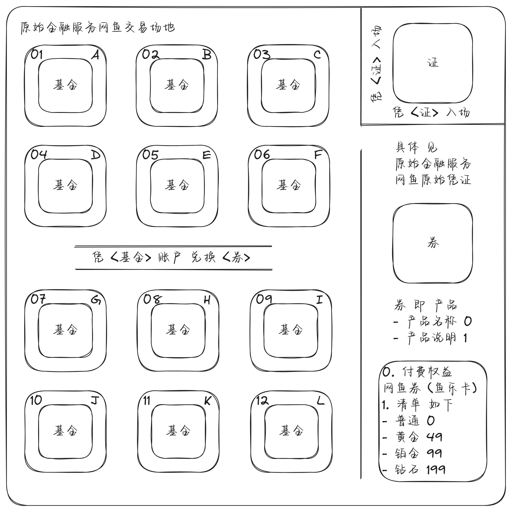

# own-pypxeserver

## Dot

0. ^ "Combined standard DHCP and redirection services. The DHCP servers that are supplying IP addresses to clients are modified to become, or are replaced by servers that serve up IP addresses for all clients and redirect PXE-enabled clients to Boot Servers as requested."
1. ^ "Separate standard DHCP and redirection services. PXE redirection servers (Proxy DHCP servers) are added to the existing network environment. They respond only to PXE-enabled clients, and provide only redirection to Boot Servers."

```plain
PS C:\Users\Administrator\Downloads\own-pypxeserver> # Install [2017.09 python-3.7.0-amd64.exe | Huaweicloud](https://mirrors.huaweicloud.com/python/3.7.0/python-3.7.0-amd64.exe)
PS C:\Users\Administrator\Downloads\own-pypxeserver>
PS C:\Users\Administrator\Downloads\own-pypxeserver> # Install [2023.03 pywin32-306.win-amd64-py3.7.exe | Github](https://github.com/mhammond/pywin32/releases/download/b306/pywin32-306.win-amd64-py3.7.exe)
PS C:\Users\Administrator\Downloads\own-pypxeserver>
PS C:\Users\Administrator\Downloads\own-pypxeserver> # Install [vc_redist.x64.exe | Microsoft](https://aka.ms/vs/17/release/vc_redist.x64.exe)
PS C:\Users\Administrator\Downloads\own-pypxeserver>
PS C:\Users\Administrator\Downloads\own-pypxeserver> # Start server_ui.py
PS C:\Users\Administrator\Downloads\own-pypxeserver> Remove-Item -ErrorAction Ignore -Recurse -Path '.\*.log', '__pycache__' ; python .\server_ui.py
```

## Infrastructure




## Dot

server.py

```plain
self.separate = 1
self.path = r'C:\Users\Administrator\Downloads\own-pypxeserver\files'
self.siaddr = '192.168.56.101'
self.router = '192.168.56.251'
```

server.log

```plain
2024-06-15 09:52:26.721 udp_server PATH C:\Users\Administrator\Downloads\own-pypxeserver\files
2024-06-15 09:52:26.721 DHCPc (68) 0.0.0.0 started...
2024-06-15 09:52:26.721 DHCPd (67) 0.0.0.0 started...
2024-06-15 09:52:26.721 PorxyDHCPd (4011) 192.168.56.101 started...
2024-06-15 09:52:26.721 TFTPd (69) 0.0.0.0 started...
2024-06-15 09:52:26.721 HTTPd (80) 0.0.0.0 started...
2024-06-15 09:52:38.018 DHCPd (67) DHCPDISCOVER received, MAC 08:BF:B8:84:8D:CD, XID 1763365464
2024-06-15 09:52:38.018 DHCPc (68) discovering for another DHCPd on LAN
2024-06-15 09:52:38.018 DHCPd (67) msg is b'\x01\x01\x06\x00i\x1a\xd2X\x00\x04\x00\x00\x00\x00\x00\x00\x00\x00\x00\x00\x00\x00\x00\x00\x00\x00\x00\x00\x08\xbf\xb8\x84\x8d\xcd\x00\x00\x00\x00\x00\x00\x00\x00\x00\x00\x00\x00\x00\x00\x00\x00\x00\x00\x00\x00\x00\x00\x00\x00\x00\x00\x00\x00\x00\x00\x00\x00\x00\x00\x00\x00\x00\x00\x00\x00\x00\x00\x00\x00\x00\x00\x00\x00\x00\x00\x00\x00\x00\x00\x00\x00\x00\x00\x00\x00\x00\x00\x00\x00\x00\x00\x00\x00\x00\x00\x00\x00\x00\x00\x00\x00\x00\x00\x00\x00\x00\x00\x00\x00\x00\x00\x00\x00\x00\x00\x00\x00\x00\x00\x00\x00\x00\x00\x00\x00\x00\x00\x00\x00\x00\x00\x00\x00\x00\x00\x00\x00\x00\x00\x00\x00\x00\x00\x00\x00\x00\x00\x00\x00\x00\x00\x00\x00\x00\x00\x00\x00\x00\x00\x00\x00\x00\x00\x00\x00\x00\x00\x00\x00\x00\x00\x00\x00\x00\x00\x00\x00\x00\x00\x00\x00\x00\x00\x00\x00\x00\x00\x00\x00\x00\x00\x00\x00\x00\x00\x00\x00\x00\x00\x00\x00\x00\x00\x00\x00\x00\x00\x00\x00\x00\x00\x00\x00\x00\x00\x00\x00\x00\x00\x00\x00\x00\x00\x00\x00\x00\x00c\x82Sc5\x01\x019\x02\x05\xc0]\x02\x00\x00^\x03\x01\x02\x01< PXEClient:Arch:00000:UNDI:002001M\x04iPXE7\x17\x01\x03\x06\x07\x0c\x0f\x11\x1a+<BCw\x80\x81\x82\x83\x84\x85\x86\x87\xaf\xcb\xaf\x18\xb1\x05\x01\x80\x86\x10\x0e!\x01\x01\x10\x01\x02\xeb\x03\x01\x00\x00\x17\x01\x01\x15\x01\x01=\x07\x01\x08\xbf\xb8\x84\x8d\xcda\x11\x00\x07=\xac7{fL\xd0\x8d1E\xeb\xe3#\x9f\xd5\xff'
2024-06-15 09:52:38.018 DHCPd (67) iPXE user-class detected
2024-06-15 09:52:38.018 DHCPd (67) DHCPOFFER sent, 255.255.255.255:68, XID 1763365464
2024-06-15 09:52:38.018 DHCPd (67) offer_packet is b'\x02\x01\x06\x00i\x1a\xd2X\x00\x00\x80\x00\x00\x00\x00\x00\x00\x00\x00\x00\xc0\xa88e\x00\x00\x00\x00\x08\xbf\xb8\x84\x8d\xcd\x00\x00\x00\x00\x00\x00\x00\x00\x00\x00S001\x00\x00\x00\x00\x00\x00\x00\x00\x00\x00\x00\x00\x00\x00\x00\x00\x00\x00\x00\x00\x00\x00\x00\x00\x00\x00\x00\x00\x00\x00\x00\x00\x00\x00\x00\x00\x00\x00\x00\x00\x00\x00\x00\x00\x00\x00\x00\x00\x00\x00\x00\x00\x00\x00\x00\x00\x00\x00\x00\x00pxelinux.0\x00\x00\x00\x00\x00\x00\x00\x00\x00\x00\x00\x00\x00\x00\x00\x00\x00\x00\x00\x00\x00\x00\x00\x00\x00\x00\x00\x00\x00\x00\x00\x00\x00\x00\x00\x00\x00\x00\x00\x00\x00\x00\x00\x00\x00\x00\x00\x00\x00\x00\x00\x00\x00\x00\x00\x00\x00\x00\x00\x00\x00\x00\x00\x00\x00\x00\x00\x00\x00\x00\x00\x00\x00\x00\x00\x00\x00\x00\x00\x00\x00\x00\x00\x00\x00\x00\x00\x00\x00\x00\x00\x00\x00\x00\x00\x00\x00\x00\x00\x00\x00\x00\x00\x00\x00\x00\x00\x00\x00\x00\x00\x00\x00\x00\x00\x00\x00\x00c\x82Sc5\x01\x02\r\x02\x0046\x04\xc0\xa88e<\tPXEClientB\x0e192.168.56.101\xff'
2024-06-15 09:52:38.018 DHCPc (68) another DHCPd detected on your LAN @ 192.168.56.100
2024-06-15 09:52:38.018 DHCPc (68) BOOTREPLY received, MAC 08:BF:B8:84:8D:CD, XID 1763365464
2024-06-15 09:52:38.018 DHCPc (68) msg is b'\x02\x01\x06\x00i\x1a\xd2X\x00\x00\x00\x00\x00\x00\x00\x00\xc0\xa88f\x00\x00\x00\x00\x00\x00\x00\x00\x08\xbf\xb8\x84\x8d\xcd\x00\x00\x00\x00\x00\x00\x00\x00\x00\x00\x00\x00\x00\x00\x00\x00\x00\x00\x00\x00\x00\x00\x00\x00\x00\x00\x00\x00\x00\x00\x00\x00\x00\x00\x00\x00\x00\x00\x00\x00\x00\x00\x00\x00\x00\x00\x00\x00\x00\x00\x00\x00\x00\x00\x00\x00\x00\x00\x00\x00\x00\x00\x00\x00\x00\x00\x00\x00\x00\x00\x00\x00\x00\x00\x00\x00\x00\x00\x00\x00\x00\x00\x00\x00\x00\x00\x00\x00\x00\x00\x00\x00\x00\x00\x00\x00\x00\x00\x00\x00\x00\x00\x00\x00\x00\x00\x00\x00\x00\x00\x00\x00\x00\x00\x00\x00\x00\x00\x00\x00\x00\x00\x00\x00\x00\x00\x00\x00\x00\x00\x00\x00\x00\x00\x00\x00\x00\x00\x00\x00\x00\x00\x00\x00\x00\x00\x00\x00\x00\x00\x00\x00\x00\x00\x00\x00\x00\x00\x00\x00\x00\x00\x00\x00\x00\x00\x00\x00\x00\x00\x00\x00\x00\x00\x00\x00\x00\x00\x00\x00\x00\x00\x00\x00\x00\x00\x00\x00\x00\x00\x00\x00\x00\x00\x00\x00\x00\x00\x00\x00\x00\x00c\x82Sc6\x04\xc0\xa88d5\x01\x02\x01\x04\xff\xff\xff\x003\x04\x00\x00\x02X\xff\x00\x00\x00\x00\x00\x00\x00\x00\x00\x00\x00\x00\x00\x00\x00\x00\x00\x00\x00\x00\x00\x00\x00\x00\x00\x00\x00\x00\x00\x00\x00\x00\x00\x00\x00\x00\x00\x00\x00\x00\x00\x00\x00\x00\x00\x00\x00\x00\x00\x00\x00\x00\x00\x00\x00\x00\x00\x00\x00\x00\x00\x00\x00\x00\x00\x00\x00\x00\x00\x00\x00\x00\x00\x00\x00\x00\x00\x00\x00\x00\x00\x00\x00\x00\x00\x00\x00\x00\x00\x00\x00\x00\x00\x00\x00\x00\x00\x00\x00\x00\x00\x00\x00\x00\x00\x00\x00\x00\x00\x00\x00\x00\x00\x00\x00\x00\x00\x00\x00\x00\x00\x00\x00\x00\x00\x00\x00\x00\x00\x00\x00\x00\x00\x00\x00\x00\x00\x00\x00\x00\x00\x00\x00\x00\x00\x00\x00\x00\x00\x00\x00\x00\x00\x00\x00\x00\x00\x00\x00\x00\x00\x00\x00\x00\x00\x00\x00\x00\x00\x00\x00\x00\x00\x00\x00\x00\x00\x00\x00\x00\x00\x00\x00\x00\x00\x00\x00\x00\x00\x00\x00\x00\x00\x00\x00\x00\x00\x00\x00\x00\x00\x00\x00\x00\x00\x00\x00\x00\x00\x00\x00\x00\x00\x00\x00\x00\x00\x00\x00\x00\x00\x00\x00\x00\x00\x00\x00\x00\x00\x00\x00\x00\x00\x00\x00\x00\x00\x00\x00\x00\x00\x00\x00\x00\x00\x00\x00\x00\x00\x00\x00\x00\x00\x00\x00\x00\x00\x00\x00\x00\x00\x00\x00\x00\x00\x00\x00\x00\x00\x00\x00\x00\x00\x00\x00\x00\x00\x00\x00\x00\x00\x00\x00\x00\x00\x00'
2024-06-15 09:52:39.018 DHCPc (68) another DHCPd detected on your LAN @ 192.168.56.101
2024-06-15 09:52:39.018 DHCPc (68) BOOTREPLY received, MAC 08:BF:B8:84:8D:CD, XID 1763365464
2024-06-15 09:52:39.018 DHCPc (68) msg is b'\x02\x01\x06\x00i\x1a\xd2X\x00\x00\x80\x00\x00\x00\x00\x00\x00\x00\x00\x00\xc0\xa88e\x00\x00\x00\x00\x08\xbf\xb8\x84\x8d\xcd\x00\x00\x00\x00\x00\x00\x00\x00\x00\x00S001\x00\x00\x00\x00\x00\x00\x00\x00\x00\x00\x00\x00\x00\x00\x00\x00\x00\x00\x00\x00\x00\x00\x00\x00\x00\x00\x00\x00\x00\x00\x00\x00\x00\x00\x00\x00\x00\x00\x00\x00\x00\x00\x00\x00\x00\x00\x00\x00\x00\x00\x00\x00\x00\x00\x00\x00\x00\x00\x00\x00pxelinux.0\x00\x00\x00\x00\x00\x00\x00\x00\x00\x00\x00\x00\x00\x00\x00\x00\x00\x00\x00\x00\x00\x00\x00\x00\x00\x00\x00\x00\x00\x00\x00\x00\x00\x00\x00\x00\x00\x00\x00\x00\x00\x00\x00\x00\x00\x00\x00\x00\x00\x00\x00\x00\x00\x00\x00\x00\x00\x00\x00\x00\x00\x00\x00\x00\x00\x00\x00\x00\x00\x00\x00\x00\x00\x00\x00\x00\x00\x00\x00\x00\x00\x00\x00\x00\x00\x00\x00\x00\x00\x00\x00\x00\x00\x00\x00\x00\x00\x00\x00\x00\x00\x00\x00\x00\x00\x00\x00\x00\x00\x00\x00\x00\x00\x00\x00\x00\x00\x00c\x82Sc5\x01\x02\r\x02\x0046\x04\xc0\xa88e<\tPXEClientB\x0e192.168.56.101\xff'
2024-06-15 09:52:39.018 DHCPd (67) DHCPREQUEST discarded, MAC 08:BF:B8:84:8D:CD, XID 1763365464
2024-06-15 09:52:39.064 TFTPd (69) DoReadFile pxelinux.0 B 26579 T 0
2024-06-15 09:52:39.080 TFTPd (69) DoReadFile default B 1948 T 0
2024-06-15 09:52:39.080 TFTPd (69) DoReadFile menu.c32 B 56292 T 0
2024-06-15 09:52:39.096 TFTPd (69) DoReadFile default B 1948 T 0
```

## Dot

server.py

```plain
self.separate = 0
self.path = r'C:\Users\Administrator\Downloads\own-pypxeserver\files'
self.siaddr = '192.168.56.101'
self.router = '192.168.56.1'
self.begin = '192.168.56.100'
self.end = '192.168.56.110'
```

server.log

```plain
2024-06-15 10:03:17.127 udp_server PATH C:\Users\Administrator\Downloads\own-pypxeserver\files
2024-06-15 10:03:17.127 DHCPc (68) 0.0.0.0 started...
2024-06-15 10:03:17.127 DHCPd (67) 0.0.0.0 started...
2024-06-15 10:03:17.127 TFTPd (69) 0.0.0.0 started...
2024-06-15 10:03:17.127 HTTPd (80) 0.0.0.0 started...
2024-06-15 10:03:45.236 DHCPd (67) DHCPDISCOVER received, MAC 08:BF:B8:84:8D:CD, XID 2271696961
2024-06-15 10:03:45.236 DHCPd (67) msg is b'\x01\x01\x06\x00\x87gXA\x00\x04\x00\x00\x00\x00\x00\x00\x00\x00\x00\x00\x00\x00\x00\x00\x00\x00\x00\x00\x08\xbf\xb8\x84\x8d\xcd\x00\x00\x00\x00\x00\x00\x00\x00\x00\x00\x00\x00\x00\x00\x00\x00\x00\x00\x00\x00\x00\x00\x00\x00\x00\x00\x00\x00\x00\x00\x00\x00\x00\x00\x00\x00\x00\x00\x00\x00\x00\x00\x00\x00\x00\x00\x00\x00\x00\x00\x00\x00\x00\x00\x00\x00\x00\x00\x00\x00\x00\x00\x00\x00\x00\x00\x00\x00\x00\x00\x00\x00\x00\x00\x00\x00\x00\x00\x00\x00\x00\x00\x00\x00\x00\x00\x00\x00\x00\x00\x00\x00\x00\x00\x00\x00\x00\x00\x00\x00\x00\x00\x00\x00\x00\x00\x00\x00\x00\x00\x00\x00\x00\x00\x00\x00\x00\x00\x00\x00\x00\x00\x00\x00\x00\x00\x00\x00\x00\x00\x00\x00\x00\x00\x00\x00\x00\x00\x00\x00\x00\x00\x00\x00\x00\x00\x00\x00\x00\x00\x00\x00\x00\x00\x00\x00\x00\x00\x00\x00\x00\x00\x00\x00\x00\x00\x00\x00\x00\x00\x00\x00\x00\x00\x00\x00\x00\x00\x00\x00\x00\x00\x00\x00\x00\x00\x00\x00\x00\x00\x00\x00\x00\x00\x00\x00\x00\x00\x00\x00\x00\x00c\x82Sc5\x01\x019\x02\x05\xc0]\x02\x00\x00^\x03\x01\x02\x01< PXEClient:Arch:00000:UNDI:002001M\x04iPXE7\x17\x01\x03\x06\x07\x0c\x0f\x11\x1a+<BCw\x80\x81\x82\x83\x84\x85\x86\x87\xaf\xcb\xaf\x18\xb1\x05\x01\x80\x86\x10\x0e!\x01\x01\x10\x01\x02\xeb\x03\x01\x00\x00\x17\x01\x01\x15\x01\x01=\x07\x01\x08\xbf\xb8\x84\x8d\xcda\x11\x00\x07=\xac7{fL\xd0\x8d1E\xeb\xe3#\x9f\xd5\xff'
2024-06-15 10:03:45.252 DHCPd (67) iPXE user-class detected
2024-06-15 10:03:45.252 DHCPd (67) DHCPOFFER sent, 255.255.255.255:68, XID 2271696961
2024-06-15 10:03:45.252 DHCPd (67) offer_packet is b'\x02\x01\x06\x00\x87gXA\x00\x00\x80\x00\x00\x00\x00\x00\xc0\xa88d\xc0\xa88e\x00\x00\x00\x00\x08\xbf\xb8\x84\x8d\xcd\x00\x00\x00\x00\x00\x00\x00\x00\x00\x00S001\x00\x00\x00\x00\x00\x00\x00\x00\x00\x00\x00\x00\x00\x00\x00\x00\x00\x00\x00\x00\x00\x00\x00\x00\x00\x00\x00\x00\x00\x00\x00\x00\x00\x00\x00\x00\x00\x00\x00\x00\x00\x00\x00\x00\x00\x00\x00\x00\x00\x00\x00\x00\x00\x00\x00\x00\x00\x00\x00\x00pxelinux.0\x00\x00\x00\x00\x00\x00\x00\x00\x00\x00\x00\x00\x00\x00\x00\x00\x00\x00\x00\x00\x00\x00\x00\x00\x00\x00\x00\x00\x00\x00\x00\x00\x00\x00\x00\x00\x00\x00\x00\x00\x00\x00\x00\x00\x00\x00\x00\x00\x00\x00\x00\x00\x00\x00\x00\x00\x00\x00\x00\x00\x00\x00\x00\x00\x00\x00\x00\x00\x00\x00\x00\x00\x00\x00\x00\x00\x00\x00\x00\x00\x00\x00\x00\x00\x00\x00\x00\x00\x00\x00\x00\x00\x00\x00\x00\x00\x00\x00\x00\x00\x00\x00\x00\x00\x00\x00\x00\x00\x00\x00\x00\x00\x00\x00\x00\x00\x00\x00c\x82Sc5\x01\x02\x01\x04\xff\xff\xff\x00\x03\x04\xc0\xa88\x01\x06\x04\xdf\x05\x05\x05\r\x02\x004\x1c\x04\xc0\xa88\xff3\x04\x00\x00\x00x6\x04\xc0\xa88eB\x0e192.168.56.101\xff'
2024-06-15 10:03:46.252 DHCPc (68) discovering for another DHCPd on LAN
2024-06-15 10:03:46.252 DHCPc (68) another DHCPd detected on your LAN @ 192.168.56.101
2024-06-15 10:03:46.252 DHCPc (68) BOOTREPLY received, MAC 08:BF:B8:84:8D:CD, XID 2271696961
2024-06-15 10:03:46.252 DHCPc (68) msg is b'\x02\x01\x06\x00\x87gXA\x00\x00\x80\x00\x00\x00\x00\x00\xc0\xa88d\xc0\xa88e\x00\x00\x00\x00\x08\xbf\xb8\x84\x8d\xcd\x00\x00\x00\x00\x00\x00\x00\x00\x00\x00S001\x00\x00\x00\x00\x00\x00\x00\x00\x00\x00\x00\x00\x00\x00\x00\x00\x00\x00\x00\x00\x00\x00\x00\x00\x00\x00\x00\x00\x00\x00\x00\x00\x00\x00\x00\x00\x00\x00\x00\x00\x00\x00\x00\x00\x00\x00\x00\x00\x00\x00\x00\x00\x00\x00\x00\x00\x00\x00\x00\x00pxelinux.0\x00\x00\x00\x00\x00\x00\x00\x00\x00\x00\x00\x00\x00\x00\x00\x00\x00\x00\x00\x00\x00\x00\x00\x00\x00\x00\x00\x00\x00\x00\x00\x00\x00\x00\x00\x00\x00\x00\x00\x00\x00\x00\x00\x00\x00\x00\x00\x00\x00\x00\x00\x00\x00\x00\x00\x00\x00\x00\x00\x00\x00\x00\x00\x00\x00\x00\x00\x00\x00\x00\x00\x00\x00\x00\x00\x00\x00\x00\x00\x00\x00\x00\x00\x00\x00\x00\x00\x00\x00\x00\x00\x00\x00\x00\x00\x00\x00\x00\x00\x00\x00\x00\x00\x00\x00\x00\x00\x00\x00\x00\x00\x00\x00\x00\x00\x00\x00\x00c\x82Sc5\x01\x02\x01\x04\xff\xff\xff\x00\x03\x04\xc0\xa88\x01\x06\x04\xdf\x05\x05\x05\r\x02\x004\x1c\x04\xc0\xa88\xff3\x04\x00\x00\x00x6\x04\xc0\xa88eB\x0e192.168.56.101\xff'
2024-06-15 10:03:46.283 DHCPd (67) DHCPDISCOVER received, MAC 08:BF:B8:84:8D:CD, XID 2271696961
2024-06-15 10:03:46.283 DHCPd (67) msg is b'\x01\x01\x06\x00\x87gXA\x00\n\x00\x00\x00\x00\x00\x00\x00\x00\x00\x00\x00\x00\x00\x00\x00\x00\x00\x00\x08\xbf\xb8\x84\x8d\xcd\x00\x00\x00\x00\x00\x00\x00\x00\x00\x00\x00\x00\x00\x00\x00\x00\x00\x00\x00\x00\x00\x00\x00\x00\x00\x00\x00\x00\x00\x00\x00\x00\x00\x00\x00\x00\x00\x00\x00\x00\x00\x00\x00\x00\x00\x00\x00\x00\x00\x00\x00\x00\x00\x00\x00\x00\x00\x00\x00\x00\x00\x00\x00\x00\x00\x00\x00\x00\x00\x00\x00\x00\x00\x00\x00\x00\x00\x00\x00\x00\x00\x00\x00\x00\x00\x00\x00\x00\x00\x00\x00\x00\x00\x00\x00\x00\x00\x00\x00\x00\x00\x00\x00\x00\x00\x00\x00\x00\x00\x00\x00\x00\x00\x00\x00\x00\x00\x00\x00\x00\x00\x00\x00\x00\x00\x00\x00\x00\x00\x00\x00\x00\x00\x00\x00\x00\x00\x00\x00\x00\x00\x00\x00\x00\x00\x00\x00\x00\x00\x00\x00\x00\x00\x00\x00\x00\x00\x00\x00\x00\x00\x00\x00\x00\x00\x00\x00\x00\x00\x00\x00\x00\x00\x00\x00\x00\x00\x00\x00\x00\x00\x00\x00\x00\x00\x00\x00\x00\x00\x00\x00\x00\x00\x00\x00\x00\x00\x00\x00\x00\x00\x00c\x82Sc5\x01\x019\x02\x05\xc0]\x02\x00\x00^\x03\x01\x02\x01< PXEClient:Arch:00000:UNDI:002001M\x04iPXE7\x17\x01\x03\x06\x07\x0c\x0f\x11\x1a+<BCw\x80\x81\x82\x83\x84\x85\x86\x87\xaf\xcb\xaf\x18\xb1\x05\x01\x80\x86\x10\x0e!\x01\x01\x10\x01\x02\xeb\x03\x01\x00\x00\x17\x01\x01\x15\x01\x01=\x07\x01\x08\xbf\xb8\x84\x8d\xcda\x11\x00\x07=\xac7{fL\xd0\x8d1E\xeb\xe3#\x9f\xd5\xff'
2024-06-15 10:03:46.283 DHCPd (67) iPXE user-class detected
2024-06-15 10:03:46.299 DHCPd (67) DHCPOFFER sent, 255.255.255.255:68, XID 2271696961
2024-06-15 10:03:46.299 DHCPd (67) offer_packet is b'\x02\x01\x06\x00\x87gXA\x00\x00\x80\x00\x00\x00\x00\x00\xc0\xa88d\xc0\xa88e\x00\x00\x00\x00\x08\xbf\xb8\x84\x8d\xcd\x00\x00\x00\x00\x00\x00\x00\x00\x00\x00S001\x00\x00\x00\x00\x00\x00\x00\x00\x00\x00\x00\x00\x00\x00\x00\x00\x00\x00\x00\x00\x00\x00\x00\x00\x00\x00\x00\x00\x00\x00\x00\x00\x00\x00\x00\x00\x00\x00\x00\x00\x00\x00\x00\x00\x00\x00\x00\x00\x00\x00\x00\x00\x00\x00\x00\x00\x00\x00\x00\x00pxelinux.0\x00\x00\x00\x00\x00\x00\x00\x00\x00\x00\x00\x00\x00\x00\x00\x00\x00\x00\x00\x00\x00\x00\x00\x00\x00\x00\x00\x00\x00\x00\x00\x00\x00\x00\x00\x00\x00\x00\x00\x00\x00\x00\x00\x00\x00\x00\x00\x00\x00\x00\x00\x00\x00\x00\x00\x00\x00\x00\x00\x00\x00\x00\x00\x00\x00\x00\x00\x00\x00\x00\x00\x00\x00\x00\x00\x00\x00\x00\x00\x00\x00\x00\x00\x00\x00\x00\x00\x00\x00\x00\x00\x00\x00\x00\x00\x00\x00\x00\x00\x00\x00\x00\x00\x00\x00\x00\x00\x00\x00\x00\x00\x00\x00\x00\x00\x00\x00\x00c\x82Sc5\x01\x02\x01\x04\xff\xff\xff\x00\x03\x04\xc0\xa88\x01\x06\x04\xdf\x05\x05\x05\r\x02\x004\x1c\x04\xc0\xa88\xff3\x04\x00\x00\x00x6\x04\xc0\xa88eB\x0e192.168.56.101\xff'
2024-06-15 10:03:47.299 DHCPd (67) DHCPREQUEST received, MAC 08:BF:B8:84:8D:CD, XID 2271696961
2024-06-15 10:03:47.299 DHCPd (67) msg is b'\x01\x01\x06\x00\x87gXA\x00\x0e\x00\x00\x00\x00\x00\x00\x00\x00\x00\x00\x00\x00\x00\x00\x00\x00\x00\x00\x08\xbf\xb8\x84\x8d\xcd\x00\x00\x00\x00\x00\x00\x00\x00\x00\x00\x00\x00\x00\x00\x00\x00\x00\x00\x00\x00\x00\x00\x00\x00\x00\x00\x00\x00\x00\x00\x00\x00\x00\x00\x00\x00\x00\x00\x00\x00\x00\x00\x00\x00\x00\x00\x00\x00\x00\x00\x00\x00\x00\x00\x00\x00\x00\x00\x00\x00\x00\x00\x00\x00\x00\x00\x00\x00\x00\x00\x00\x00\x00\x00\x00\x00\x00\x00\x00\x00\x00\x00\x00\x00\x00\x00\x00\x00\x00\x00\x00\x00\x00\x00\x00\x00\x00\x00\x00\x00\x00\x00\x00\x00\x00\x00\x00\x00\x00\x00\x00\x00\x00\x00\x00\x00\x00\x00\x00\x00\x00\x00\x00\x00\x00\x00\x00\x00\x00\x00\x00\x00\x00\x00\x00\x00\x00\x00\x00\x00\x00\x00\x00\x00\x00\x00\x00\x00\x00\x00\x00\x00\x00\x00\x00\x00\x00\x00\x00\x00\x00\x00\x00\x00\x00\x00\x00\x00\x00\x00\x00\x00\x00\x00\x00\x00\x00\x00\x00\x00\x00\x00\x00\x00\x00\x00\x00\x00\x00\x00\x00\x00\x00\x00\x00\x00\x00\x00\x00\x00\x00\x00c\x82Sc5\x01\x039\x02\x05\xc0]\x02\x00\x00^\x03\x01\x02\x01< PXEClient:Arch:00000:UNDI:002001M\x04iPXE7\x17\x01\x03\x06\x07\x0c\x0f\x11\x1a+<BCw\x80\x81\x82\x83\x84\x85\x86\x87\xaf\xcb\xaf\x18\xb1\x05\x01\x80\x86\x10\x0e!\x01\x01\x10\x01\x02\xeb\x03\x01\x00\x00\x17\x01\x01\x15\x01\x01=\x07\x01\x08\xbf\xb8\x84\x8d\xcda\x11\x00\x07=\xac7{fL\xd0\x8d1E\xeb\xe3#\x9f\xd56\x04\xc0\xa88e2\x04\xc0\xa88d\xff'
2024-06-15 10:03:47.299 DHCPd (67) iPXE user-class detected
2024-06-15 10:03:47.299 DHCPd (67) DHCPACK sent, 255.255.255.255:68, XID 2271696961
2024-06-15 10:03:47.299 DHCPd (67) ack_packet is b'\x02\x01\x06\x00\x87gXA\x00\x00\x80\x00\x00\x00\x00\x00\xc0\xa88d\xc0\xa88e\x00\x00\x00\x00\x08\xbf\xb8\x84\x8d\xcd\x00\x00\x00\x00\x00\x00\x00\x00\x00\x00S001\x00\x00\x00\x00\x00\x00\x00\x00\x00\x00\x00\x00\x00\x00\x00\x00\x00\x00\x00\x00\x00\x00\x00\x00\x00\x00\x00\x00\x00\x00\x00\x00\x00\x00\x00\x00\x00\x00\x00\x00\x00\x00\x00\x00\x00\x00\x00\x00\x00\x00\x00\x00\x00\x00\x00\x00\x00\x00\x00\x00pxelinux.0\x00\x00\x00\x00\x00\x00\x00\x00\x00\x00\x00\x00\x00\x00\x00\x00\x00\x00\x00\x00\x00\x00\x00\x00\x00\x00\x00\x00\x00\x00\x00\x00\x00\x00\x00\x00\x00\x00\x00\x00\x00\x00\x00\x00\x00\x00\x00\x00\x00\x00\x00\x00\x00\x00\x00\x00\x00\x00\x00\x00\x00\x00\x00\x00\x00\x00\x00\x00\x00\x00\x00\x00\x00\x00\x00\x00\x00\x00\x00\x00\x00\x00\x00\x00\x00\x00\x00\x00\x00\x00\x00\x00\x00\x00\x00\x00\x00\x00\x00\x00\x00\x00\x00\x00\x00\x00\x00\x00\x00\x00\x00\x00\x00\x00\x00\x00\x00\x00c\x82Sc5\x01\x05\x01\x04\xff\xff\xff\x00\x03\x04\xc0\xa88\x01\x06\x04\xdf\x05\x05\x05\r\x02\x004\x1c\x04\xc0\xa88\xff3\x04\x00\x00\x00x6\x04\xc0\xa88eB\x0e192.168.56.101\xff'
2024-06-15 10:03:47.330 TFTPd (69) DoReadFile pxelinux.0 B 26579 T 0
2024-06-15 10:03:47.346 TFTPd (69) DoReadFile default B 1948 T 0
2024-06-15 10:03:47.361 TFTPd (69) DoReadFile menu.c32 B 56292 T 0
2024-06-15 10:03:47.361 TFTPd (69) DoReadFile default B 1948 T 0
```